# Pratikum 4 web Layout Sederhana

### Membuat Box Element
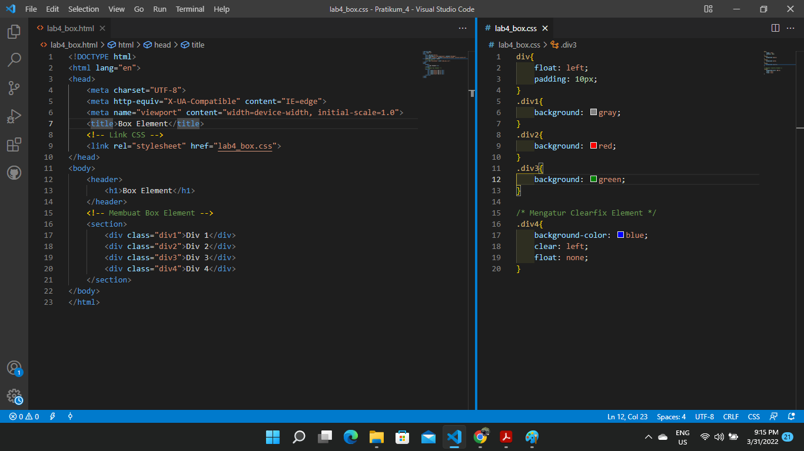
* `<header>` element merepresentasikan konten pengantar, pembukaan atau navigasi yang terdiri dari deretan link.
* HTML tag `<section>` merepresentasikan sebuah bagian dokumen atau aplikasi. Secara kontekstual, `<section>` element digunakan untuk mengelompokkan konten/dokumen menjadi beberapa bagian berdasarkan tema atau pokok pikiran masing-masing.
* Float digunakan untuk mengatur posisi elemen secara horizontal, Value yang bisa anda gunakan untuk property float ini ada left,right,inherit, dan none.
* (clear CSS) digunakan untuk membersihkan element yang sebelumnya telah mengalami float/ Sehingga element yang di-clear akan berpisah dari element yang mengalami float dan akan berpindah pada barisan baru. 

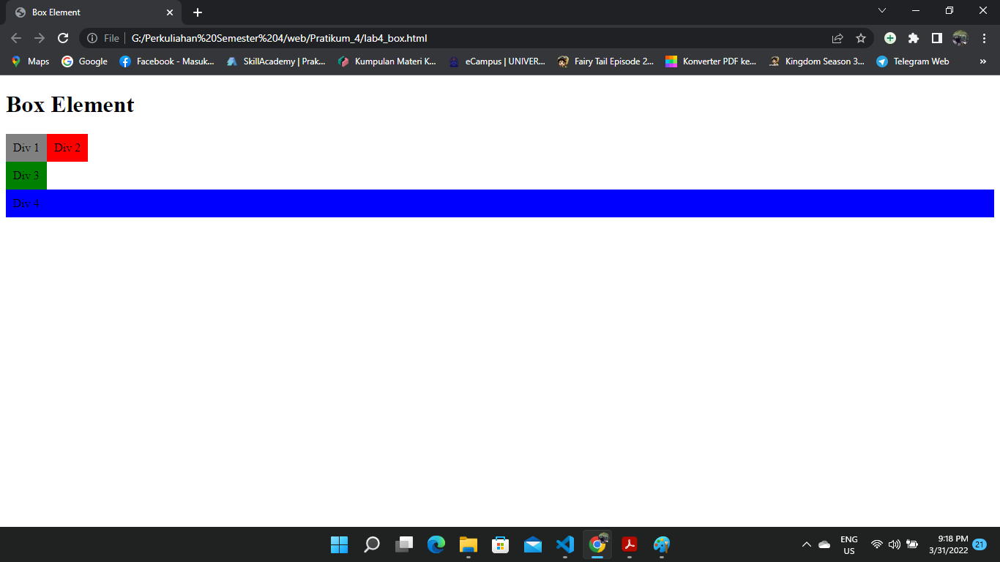

### Layout Sederhana

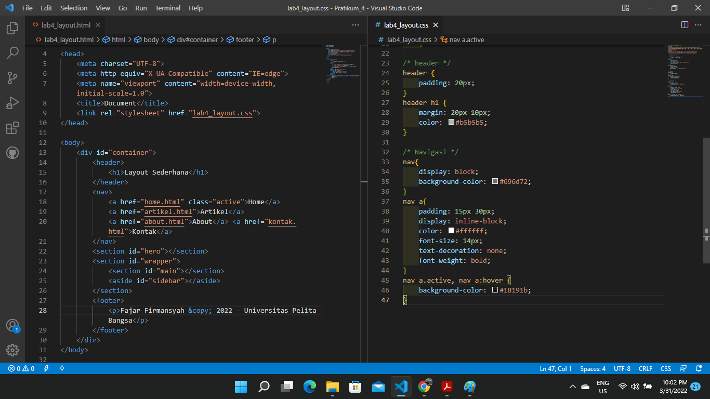
###  HTML
* `
` biasanya untuk mengelompokkan elemen atau tag-tag agar menjadi satu grup.
* `<h1>` Biasanya Digunakan untuk membuat sebuah judul konten
* `<header>` element merepresentasikan konten pengantar, pembukaan atau navigasi yang terdiri dari deretan link.
* `<nav>` adalah element pada HTML yang dibuat untuk mempresentasikan link navigasi.Tetapi link yang berada pada element `<nav>` biasanya adalah link major yang merujuk kepada halaman lain pada website kita.
* `
` untuk membuat sebuah paragraf
* `<aside>` merupakan element tambahan yang digunakan sebagai konten pelengkap bagi artikel utama pada halaman HTML.
### CSS
* (*) untuk mereset dalam HTML dengan "padding:0; margin:0;"
Maka Tampilan akan seperti dibawah
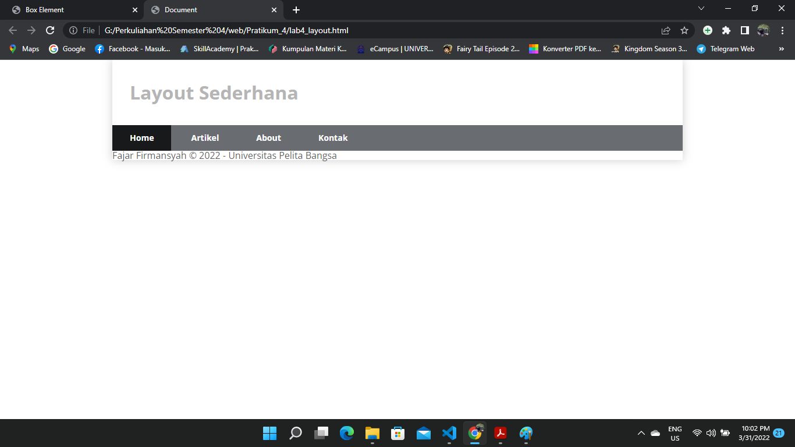

### Memasukan H1 dan 

        Pada Bagian <section id="hero">, memberikan judul <h1> dan sebuah Paragraf 
 lalu memberikan memasukan tag link <a>
### CSS
* #hero, dengan background-color #e4e4e5, memasukan padding dengan 50px 20px,, margin-bottom jarak kebawah dengan 20px.
* #hero h1, memberikan jarak kebawah dengan 20px, dan ukuran huruf 35px.
* #hero p. memberikan jarak kebawah dengan 20px ukuran huruf 18px, line-height (memberikan jarak pada paragfra ) dengan ukuran 25px

### CSS
* #wrapper, dengan margin 0px
* #main, float: lef; panjang(width) 640px, padding 20px.
* #sidebar, float: lef; panjang(width) 260px, padding 20px.
maka tampilanya akan seperti dibawah.

        Membuat class "widget-box" lalu memasukan `<h3>` dan `<ul>` `<li>` `<a>`. Maka Tampilanya akan seperti dibawah ini

### Membuat Footer

### Membuat Konten

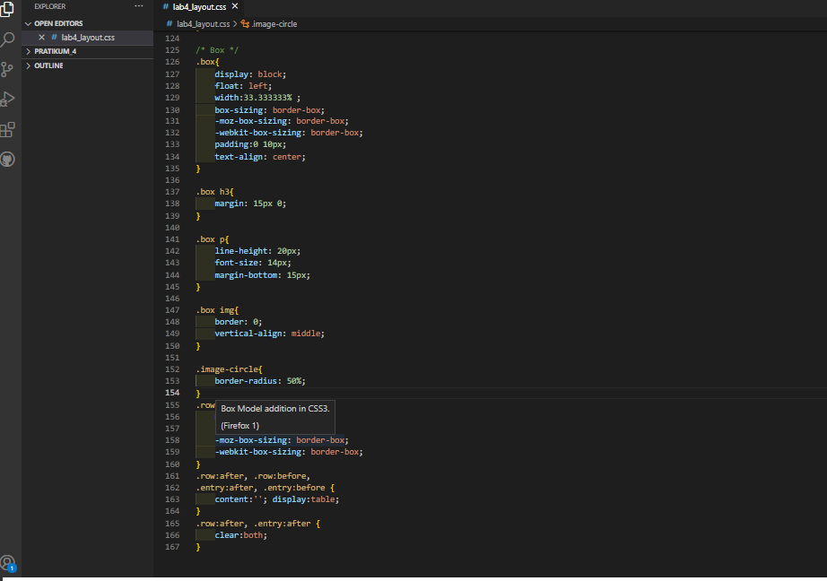

### Membuat Artikel

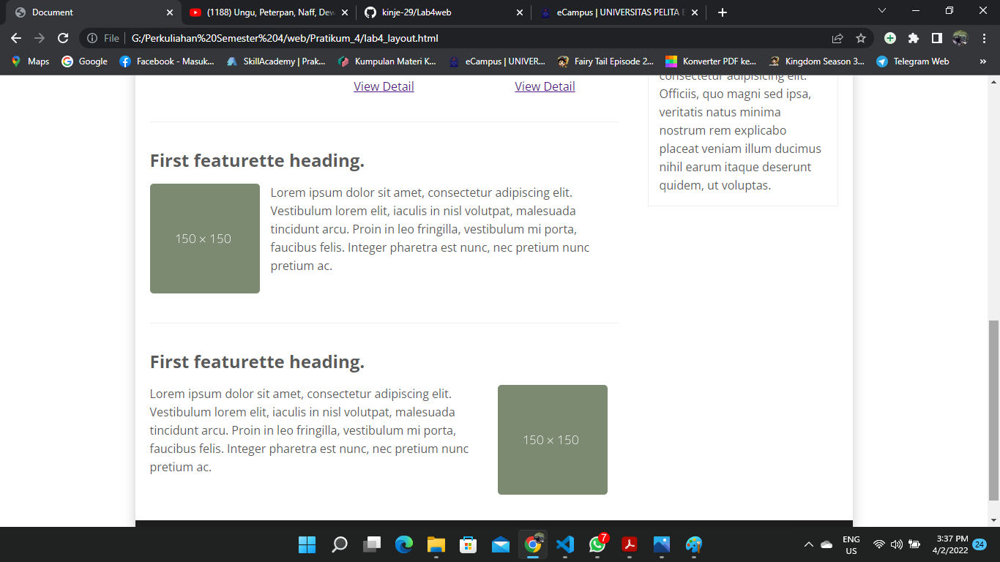

# Pertanyaan Dan Tugas
1. Tambahkan Layout untuk menu About
=> buat single layout yang berisi deskripsi, portfolio, dll
2. Tambahkan layout untuk menu Contact
=> yang berisi form isian: nama, email, message, dll

### MEmbuat Menu About
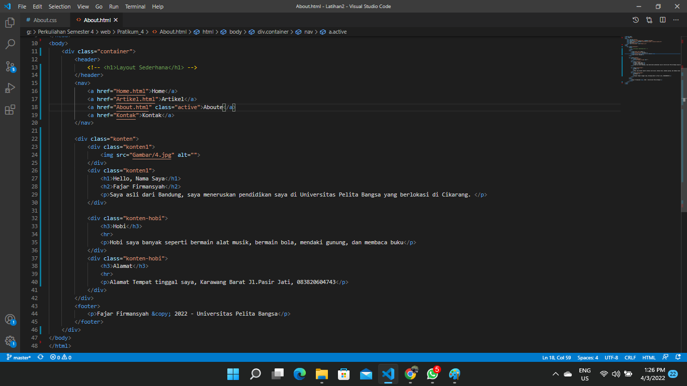

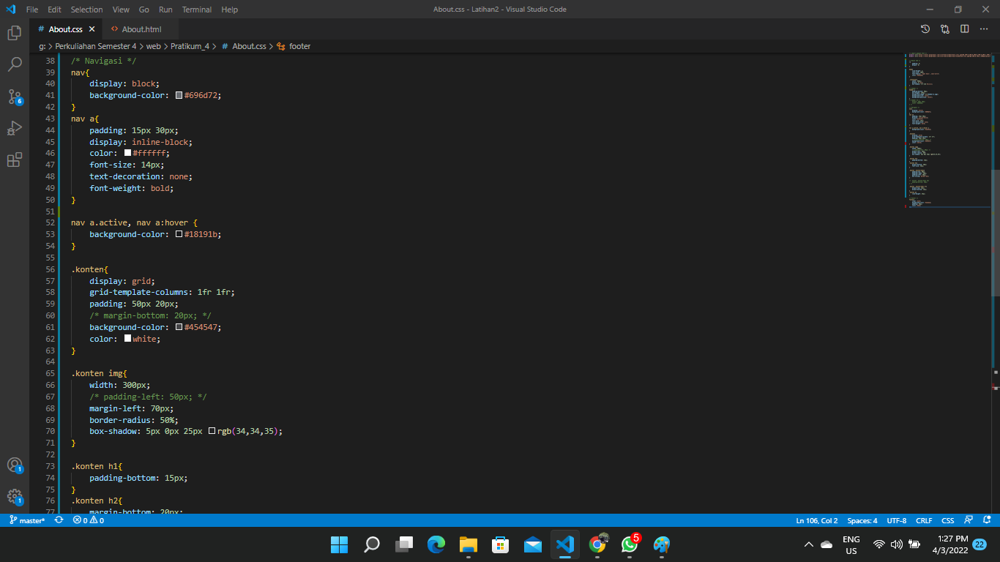
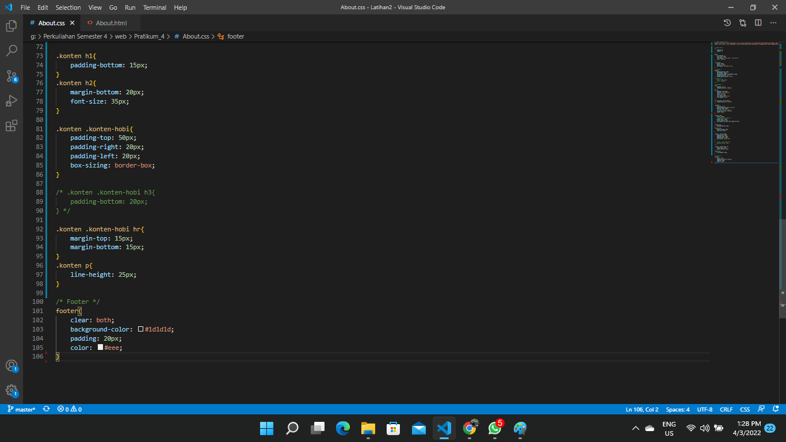
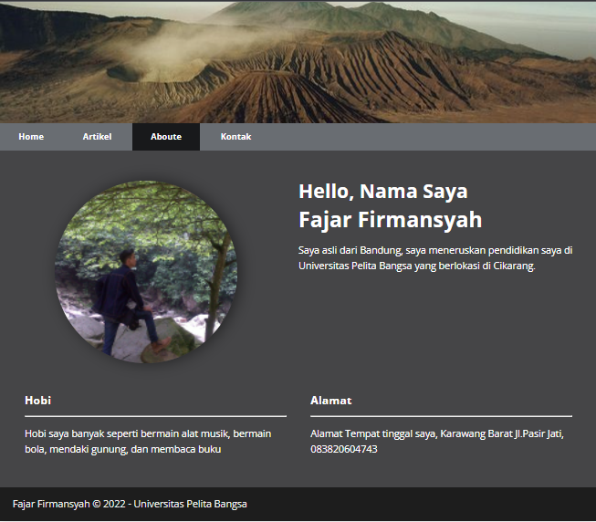

### Membuat Menu Kontak
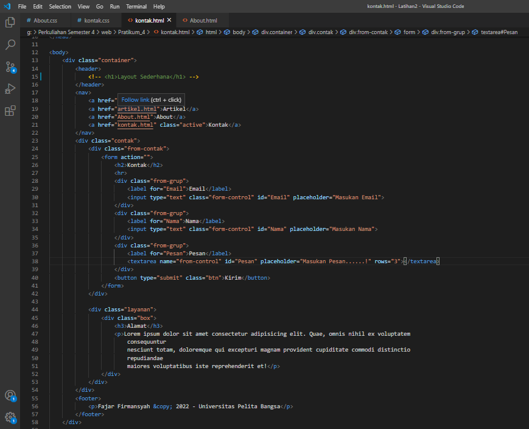

