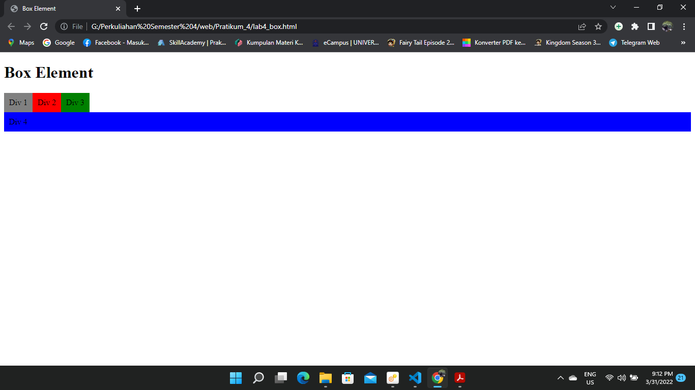
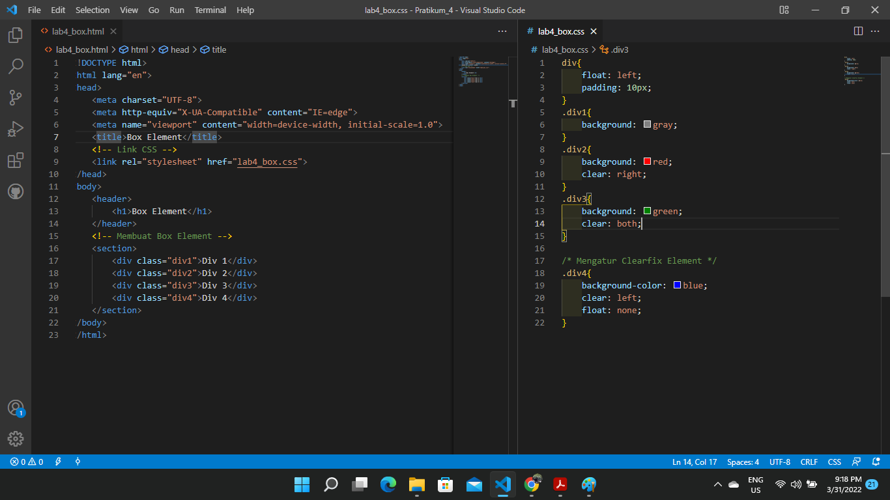
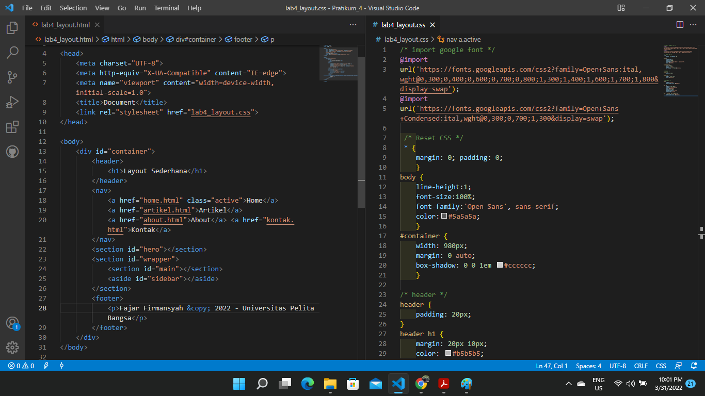
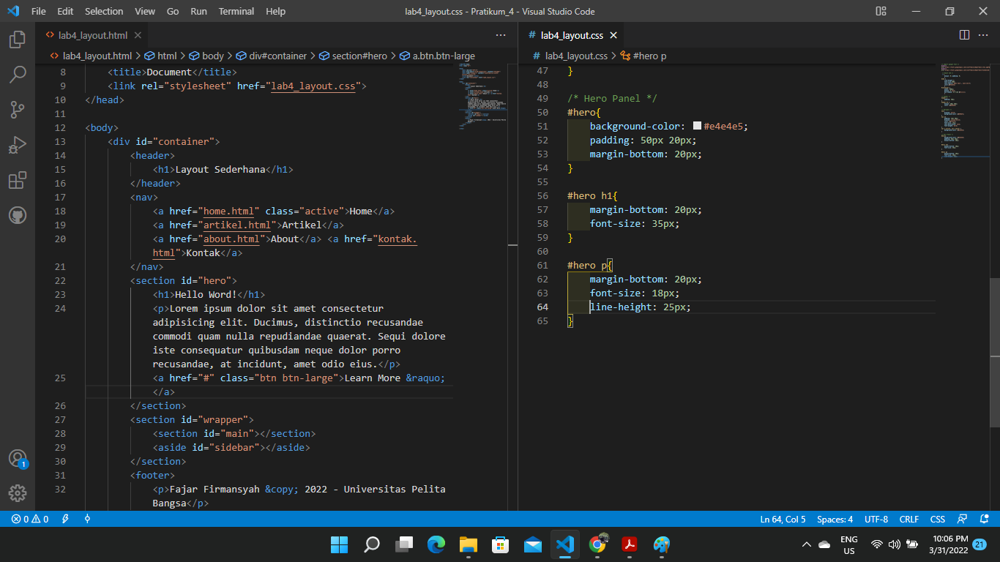
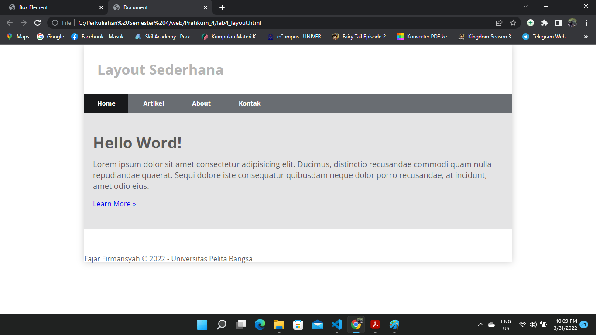
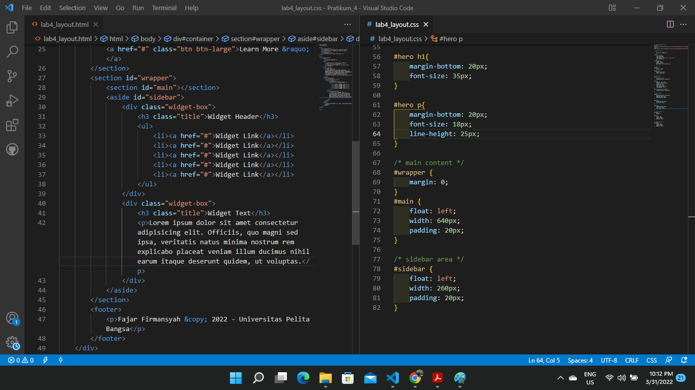
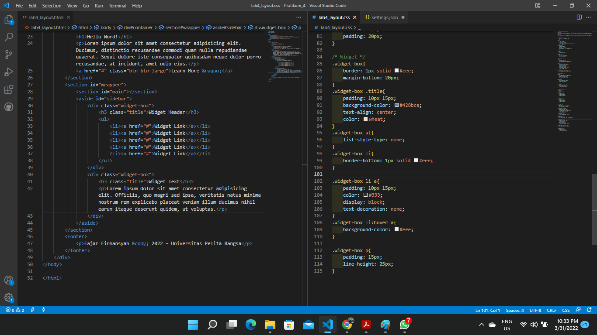
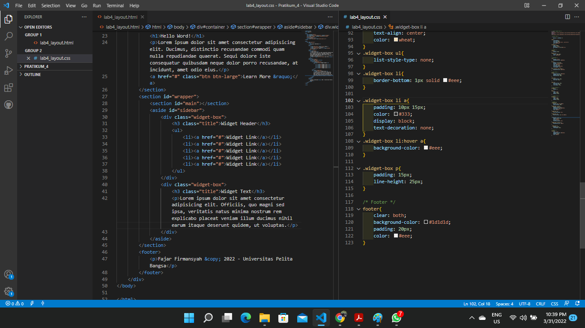
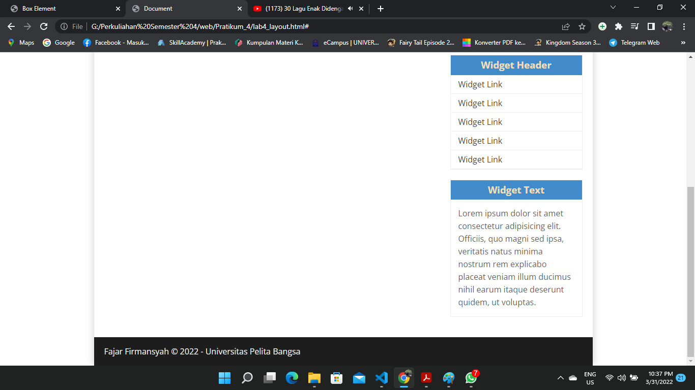
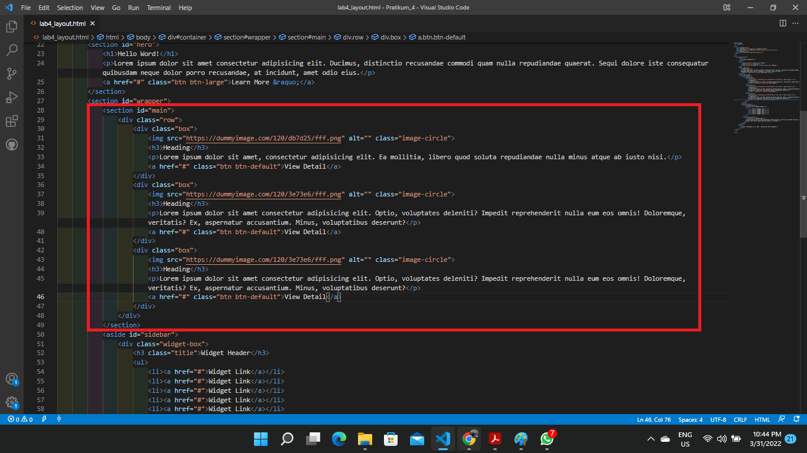

# Pratikum 4 web Layout Sederhana

### Membuat Box Element

        `<header>` element merepresentasikan konten pengantar, pembukaan atau navigasi yang terdiri dari deretan link.
        HTML tag `<section>` merepresentasikan sebuah bagian dokumen atau aplikasi. Secara kontekstual, `<section>` element digunakan untuk mengelompokkan konten/dokumen menjadi beberapa bagian berdasarkan tema atau pokok pikiran masing-masing.
        Float digunakan untuk mengatur posisi elemen secara horizontal, Value yang bisa anda gunakan untuk property float ini ada left,right,inherit, dan none.
        (clear CSS) digunakan untuk membersihkan element yang sebelumnya telah mengalami float/ Sehingga element yang di-clear akan berpisah dari element yang mengalami float dan akan berpindah pada barisan baru. 

### Layout Sederhana

    >  HTML
    `
` biasanya untuk mengelompokkan elemen atau tag-tag agar menjadi satu grup.
    `<h1>` Biasanya Digunakan untuk membuat sebuah judul konten
    `<header>` element merepresentasikan konten pengantar, pembukaan atau navigasi yang terdiri dari deretan link.
    `<nav>` adalah element pada HTML yang dibuat untuk mempresentasikan link navigasi.Tetapi link yang berada pada element `<nav>` biasanya adalah link major yang merujuk kepada halaman lain pada website kita.
    `
` untuk membuat sebuah paragraf
    `<aside>` merupakan element tambahan yang digunakan sebagai konten pelengkap bagi artikel utama pada halaman HTML.
    > CSS
    (*) untuk mereset dalam HTML dengan "padding:0; margin:0;"

    Maka Tampilan akan seperti dibawah

